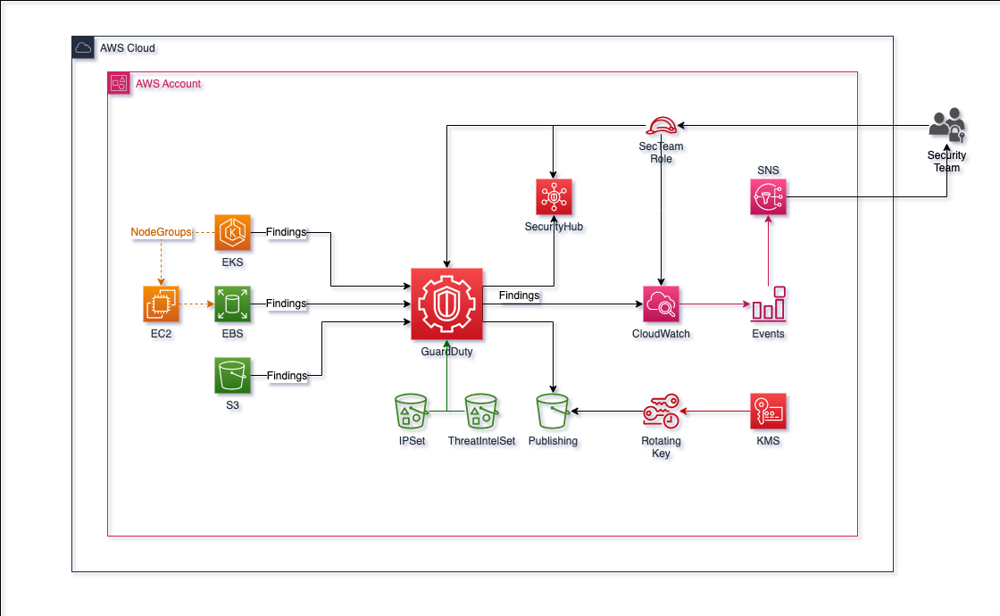
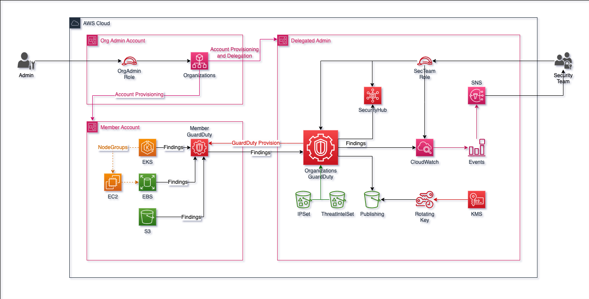

# Terraform Module for AWS GuardDuty

Terraform module that creates AWS GuardDuty resources.

- [Terraform Module for AWS GuardDuty](#terraform-module-for-aws-guardduty)
  - [Usage](#usage)
    - [Standalone](#standalone)
    - [Organizations](#organizations)
  - [Overview Diagrams](#overview-diagrams)
    - [Standalone](#standalone-1)
    - [Organizations](#organizations-1)
  - [Terraform Module](#terraform-module)

## Usage

### Standalone

```hcl
module "guardduty" {
  source = "aws-ia/terraform-aws-guardduty/aws"

  replica_region               = "us-east-1"
  enable_guardduty             = true
  enable_s3_protection         = true
  enable_kubernetes_protection = true
  enable_malware_protection    = true
  enable_snapshot_retention    = true
  finding_publishing_frequency = "FIFTEEN_MINUTES"
  filter_config = [{
    name        = "guardduty_filter"
    description = "AWS GuardDuty example filter."
    rank        = 1
    action      = "ARCHIVE"
    criterion = [

      {
        field  = "region"
        equals = ["us-west-2"]
      },
      {
        field      = "service.additionalInfo.threatListName"
        not_equals = ["some-threat", "another-threat"]
      },
      {
        field        = "updatedAt"
        greater_than = "2023-01-01T00:00:00Z"
        less_than    = "2023-12-31T23:59:59Z"
      },
      {
        field                 = "severity"
        greater_than_or_equal = "4"
      }
  ] }]

  ipset_config = [{
    activate = false
    name     = "DefaultGuardDutyIPSet"
    format   = "TXT"
    content  = "10.0.0.0/8\n"
    key      = "DefaultGuardDutyIPSet"
  }]

  threatintelset_config = [{
    activate   = false
    name       = "DefaultGuardThreatIntelSet"
    format     = "TXT"
    content    = "1.10.16.0/20\n1.19.0.0/16\n"
    key        = "DefaultGuardThreatIntelSet"
    object_acl = "public-read"

  }]
  publish_to_s3        = true
  guardduty_bucket_acl = "private"
  tags                 = {}
}
```

### Organizations

```hcl
module "delegated_admin" {
  source = "aws-ia/terraform-aws-guardduty/aws//modules/organizations_admin"

  admin_account_id                 = data.aws_caller_identity.current.account_id
  auto_enable_organization_members = "ALL"
  guardduty_detector_id            = module.guardduty_detector.guardduty_detector.id

  enable_s3_protection         = true
  enable_kubernetes_protection = true
  enable_malware_protection    = true
}

module "guardduty_detector" {
  source = "aws-ia/terraform-aws-guardduty/aws"

  enable_guardduty = true

  enable_s3_protection         = true
  enable_kubernetes_protection = true
  enable_malware_protection    = true
  enable_snapshot_retention    = true
  finding_publishing_frequency = "FIFTEEN_MINUTES"
  tags                         = {}
}
```

## Overview Diagrams

### Standalone



### Organizations



## Terraform Module
